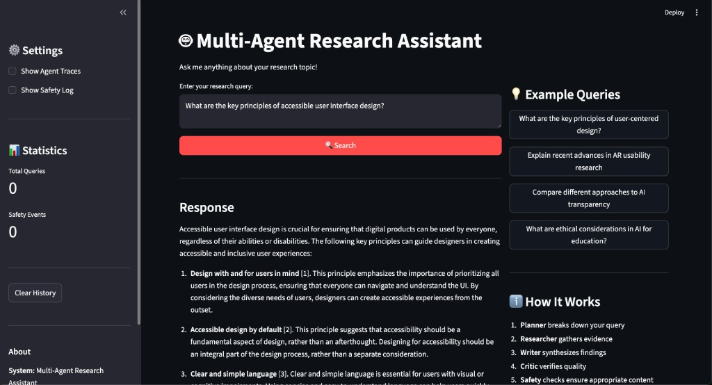
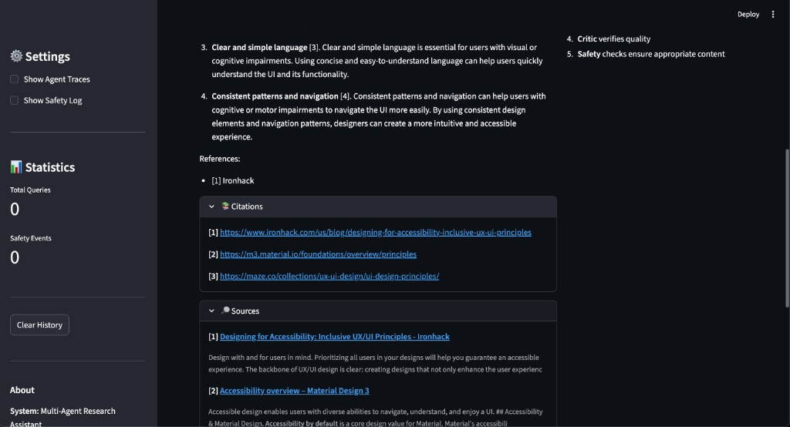
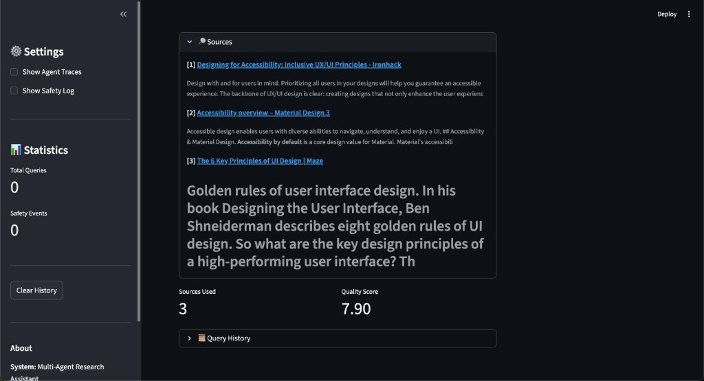

[](https://classroom.github.com/a/SEjAoIAq)

# Multi-Agent Research System - Assignment 3

This project implements a multi-agent deep-research assistant for HCI-related topics using AutoGen. The system coordinates multiple specialized agents, integrates external search tools, applies input/output safety guardrails, and supports LLM-as-a-Judge evaluation over a batch of HCI queries.

## What This System Does

- Accepts an HCI-oriented research question through a CLI or Streamlit web UI
- Uses a multi-agent workflow to plan, gather evidence, synthesize findings, and critique the final answer
- Surfaces agent traces and source citations to make the process transparent
- Applies safety guardrails to detect unsafe inputs and redact or refuse unsafe outputs
- Evaluates responses with multiple judge perspectives and saves aggregate reports under `outputs/`

## System Architecture

The system uses four AutoGen agents:

- `Planner`: breaks the research query into concrete subgoals
- `Researcher`: uses `web_search()` and `paper_search()` to gather evidence
- `Writer`: synthesizes findings into a structured response with inline source references
- `Critic`: reviews the draft for quality, completeness, and clarity

The high-level control flow is:

1. Input guardrail checks the user query
2. AutoGen team runs planner -> researcher -> writer -> critic
3. The orchestrator extracts citations, traces, and source metadata
4. Output guardrail checks the final response for PII, unsafe content, and weak grounding
5. The UI displays the final answer, citations, traces, and any safety events

## Project Structure

```text
.
├── src/
│   ├── agents/
│   │   └── autogen_agents.py          # AutoGen agent creation + tool wiring
│   ├── autogen_orchestrator.py        # Multi-agent orchestration scaffold
│   ├── guardrails/
│   │   ├── safety_manager.py          # Safety coordination scaffold
│   │   ├── input_guardrail.py         # Input validation scaffold
│   │   └── output_guardrail.py        # Output validation scaffold
│   ├── tools/
│   │   ├── web_search.py              # Tavily / Brave search
│   │   ├── paper_search.py            # Semantic Scholar search
│   │   └── citation_tool.py           # Citation formatting utilities
│   ├── evaluation/
│   │   ├── judge.py                   # LLM-as-a-Judge scaffold
│   │   └── evaluator.py               # Batch evaluation scaffold
│   └── ui/
│       ├── cli.py                     # Interactive CLI
│       └── streamlit_app.py           # Streamlit web UI
├── data/
│   ├── example_queries.json           # Primary evaluation dataset
│   └── test_queries_sample.json       # Alternate/fallback dataset
├── docs/
│   └── TODO_AUDIT_AND_SOLUTIONS.md    # TODO inventory + guidance notes
├── config.yaml
├── requirements.txt
├── .env.example
├── example_autogen.py
└── main.py
```

## Setup

### 1) Prerequisites

- Python 3.9+
- `uv` (recommended) or `pip`

### 2) Install dependencies

Using `uv`:

```bash
uv venv
source .venv/bin/activate
uv pip install -r requirements.txt
```

Using `pip`:

```bash
python -m venv venv
source venv/bin/activate
pip install -r requirements.txt
```

### 3) Configure environment variables

```bash
cp .env.example .env
```

Minimum required keys:

- One model API path:
  - `OPENAI_API_KEY` (+ `OPENAI_BASE_URL` for vLLM/OpenAI-compatible endpoints), or
  - `GROQ_API_KEY`
- One search API:
  - `TAVILY_API_KEY` or `BRAVE_API_KEY`

Optional:

- `SEMANTIC_SCHOLAR_API_KEY` (recommended for higher paper-search rate limits)

Important:

- Do not commit `.env`
- Keep your API keys local only
- If you use the course-provided OpenAI-compatible endpoint, set `OPENAI_MODEL` to the model name provided by the instructor

## Running

### AutoGen example mode (default)

```bash
python main.py
# or
python main.py --mode autogen
```

### CLI

```bash
python main.py --mode cli
```

### Streamlit web UI

```bash
python main.py --mode web
# or
streamlit run src/ui/streamlit_app.py
```

### Batch evaluation scaffold

```bash
python main.py --mode evaluate
```

This loads queries from `data/example_queries.json`, runs the system over the dataset, and writes detailed and summary reports to `outputs/`.

## Safety Design

The system includes both input and output guardrails:

- Input checks flag harmful requests, prompt injection attempts, abusive language, and off-topic queries
- Output checks look for PII, unsafe instructions, biased language, and basic grounding mismatches
- Safety events are logged with timestamps, action taken, and violation reasons
- The UI exposes when a response was allowed, sanitized, or refused

Current policy categories:

- `harmful_content`
- `personal_attacks`
- `misinformation`
- `off_topic_queries`
- `prompt_injection`
- `pii`

## Evaluation Design

The evaluation pipeline uses `LLMJudge` with two independent judging perspectives:

- `research_rigor`: emphasizes evidence quality, completeness, and research grounding
- `usability_reader`: emphasizes clarity, usefulness, and safety communication

Responses are scored against the configured criteria in `config.yaml`:

- relevance
- evidence quality
- factual accuracy
- safety compliance
- clarity

Evaluation inputs live in `data/example_queries.json`, which already contains more than 5 diverse HCI prompts.

## Reproducibility Checklist

To reproduce the full system locally:

1. Install dependencies
2. Create `.env` with model and search API keys
3. Run `python main.py --mode web` or `python main.py --mode cli`
4. Try at least one HCI research query
5. Run `python main.py --mode evaluate`
6. Inspect generated reports under `outputs/`

Recommended demo query:

```text
What are the key principles of accessible user interface design?
```

Representative artifact:

- `docs/sample_run.md`

## Demo Screenshots

Main interface after answering the demo accessibility query:



Expanded citations panel showing grounded links:



Expanded sources panel showing retrieved evidence snippets:



## Assignment Checklist (What Students Still Need To Complete)

- [x] Finalize agent prompts/roles and end-to-end orchestration behavior.
- [x] Finish tool integration and evidence formatting.
- [x] Complete safety/guardrail logic and connect it to runtime flow.
- [x] Surface safety outcomes clearly in the UI.
- [x] Finish LLM-as-a-Judge scoring and batch evaluation reporting.
- [x] Ensure CLI/web interfaces show traces and citations clearly.
- [x] Add screenshots to the README.
- [x] Export one representative end-to-end session artifact to `docs/`.
- [x] Prepare a technical report draft in `TECHNICAL_REPORT_DRAFT.md`.

## Notes

- Some modules are intentionally partial and include TODO markers for students to complete.
- Use `ASSIGNMENT_INSTRUCTIONS.md` as the primary guide for where each requirement should be implemented.

## References

- [AutoGen documentation](https://microsoft.github.io/autogen/)
- [Tavily API](https://docs.tavily.com/)
- [Semantic Scholar API](https://api.semanticscholar.org/)
- [Guardrails AI](https://docs.guardrailsai.com/)
- [NeMo Guardrails](https://docs.nvidia.com/nemo/guardrails/)
